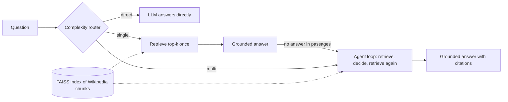

# SmartRAG: adaptive agentic question answering

SmartRAG is a question-answering assistant over a knowledge base of computer-networking articles. Before answering, it decides **how much work each question needs**:

| Mode | When | What happens |
|---|---|---|
| ⚡ Direct answer | Simple, general questions ("What does DNS stand for?") | The LLM answers from its own knowledge. No search. |
| 🔍 Single search | Specific facts ("What port does HTTPS use?") | Retrieve the top passages once, answer with citations. |
| 🧠 Multi-step research | Multi-hop questions ("Which protocol connects autonomous systems, and is it path-vector?") | An agent loop: search, decide whether more information is needed, search again (up to 3 searches), then answer. |

A trained **query-complexity router** picks the mode. If a single search can't answer, the system **escalates** to multi-step research automatically. Easy questions stay fast and cheap; hard questions get the extra effort they need.

The routing idea comes from *Adaptive-RAG* (Jeong et al., NAACL 2024). This project is an independent, lightweight implementation packaged as a usable app.

> Demo: _add your Hugging Face Spaces link here_
> Screenshot: _add a screenshot or GIF of the app here_

## Architecture



**Components**

- `build_index.py` downloads the articles in `data/topics.txt` from Wikipedia, removes reference sections, splits them into 200-word chunks with 40-word overlap, embeds them with `all-MiniLM-L6-v2`, and stores them in a FAISS index.
- `retriever.py` does cosine-similarity search over the index.
- `pipelines.py` implements the three answering strategies, the multi-step agent loop (the LLM replies `SEARCH: <query>` or `ANSWER: <answer>`), escalation, and per-request cost tracking.
- `router.py` predicts the mode with one of three backends: a fine-tuned **DistilBERT** classifier, **sentence embeddings + logistic regression**, or a keyword **heuristic** fallback.
- `train_router.py` trains the router from labeled questions.
- `app.py` is the Streamlit interface showing the answer, chosen mode, router confidence, steps taken, sources, and cost.
- `eval/run_eval.py` compares the adaptive system against fixed strategies.

## Results

Evaluated on 30 hand-written questions (10 easy, 10 moderate, 10 multi-hop) in `eval/questions.json`.

_Run `python eval/run_eval.py` and paste `eval/summary.md` here. Example layout:_

| Setup | Accuracy | Avg LLM calls | Avg searches | Avg time (s) |
|---|---|---|---|---|
| adaptive | | | | |
| always_single | | | | |
| always_multi | | | | |

Correctness is checked with keyword groups and should be reviewed by hand in `eval/results.csv`. The test set is small and was written by the author, so treat the numbers as indicative.

## Quick start

```bash
git clone https://github.com/<your-username>/smartrag.git
cd smartrag
python -m venv .venv && source .venv/bin/activate   # Windows: .venv\Scripts\activate
pip install -r requirements.txt

cp .env.example .env        # then put your API key in .env (Groq has a free tier)

python build_index.py       # downloads ~47 articles and builds the index (a few minutes)
python train_router.py      # trains the logistic-regression router on the seed labels (seconds)
streamlit run app.py
```

Run the offline tests (no API key needed):

```bash
pytest -q
```

## Training a stronger router

The included `router_data/seed_labels.jsonl` has 72 hand-labeled questions, enough for a working demo. For a stronger router, train DistilBERT on the labeled data released with Adaptive-RAG:

1. Download `data.tar.gz` from the [Adaptive-RAG repository](https://github.com/starsuzi/Adaptive-RAG) and extract it.
2. Find the classifier training file (for example `find data -name "*.json"`). Questions are labeled `A` (no retrieval), `B` (single-step), or `C` (multi-step).
3. Train, ideally on a GPU (Google Colab's free tier is enough):

```bash
python train_router.py --backend distilbert --data path/to/train.json router_data/seed_labels.jsonl
```

The loader accepts `.json` or `.jsonl` files with common field names and prints how many labeled questions it kept from each file. If it keeps 0 rows, check the file's field names.

Note: Adaptive-RAG's labels come from open-domain Wikipedia QA datasets, which match this project's Wikipedia knowledge base. On very different documents, add some of your own labeled questions.

## Changing the knowledge base

Edit `data/topics.txt` (one Wikipedia title per line), then run `python build_index.py --refresh`. Update the example questions in `app.py` and `eval/questions.json` to match.

## Deploying on Hugging Face Spaces

1. Create a new Space and choose the Streamlit option (Hugging Face may offer it as a Docker template; follow the current instructions on the Space creation page).
2. Push this repository, including the `index/` and `router_model/` folders (they are small).
3. In the Space settings, add `LLM_API_KEY` (and optionally `LLM_BASE_URL`, `LLM_MODEL`) as secrets. They're available to the app as environment variables.
4. Make sure the Space's configuration points to `app.py` as the app file.

## Limitations and next steps

- The heuristic and small seed set are only a starting point; the router is the main thing to improve.
- Multi-step answers depend on the LLM following the `SEARCH:`/`ANSWER:` format; unparseable replies are treated as answers.
- Retrieval is dense-only. Adding BM25 and Reciprocal Rank Fusion would help with exact terms like port numbers and RFC IDs.
- Ideas: a cost-aware router threshold, a reranker, and a larger labeled test set.


Knowledge base text comes from Wikipedia (CC BY-SA).

